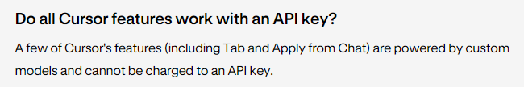

| Cursor pro                                    | 自备 API                                       |
| --------------------------------------------- | ---------------------------------------------- |
| - 无限次 tab（原 copilot++）补全              | - 2000 次补全                                  |
| - 500 次高级模型（gpt4o, sonnet 3.5）快速响应 | - 0 次高级模型快速响应/自备 API 按 token 计费  |
| - 无限次高级模型慢速响应                      | - 50 次高级模型慢速响应/自备 API 按 token 计费 |
| - 无限次低级模型（gpt3.5 turbo）响应          | - 200 次低级模型响应                           |
| - 可以把 chat 里的代码直接 apply 到代码文件   | - 不能直接 apply                               |

以上的额度均以月为单位。
按照官方说法，tab 补全的高级特性（多行补全、隔行补全等）不能在自定义 API 的时候使用，但是实测可以用。

另外官方提供的 chat 是按次数计算，自备 API 是按 token 计算，官方说自备 API 的花费有可能比订阅的 20 刀更多，这句话是真的，下面是我针对某个问题提问了四次的 token 花费：

