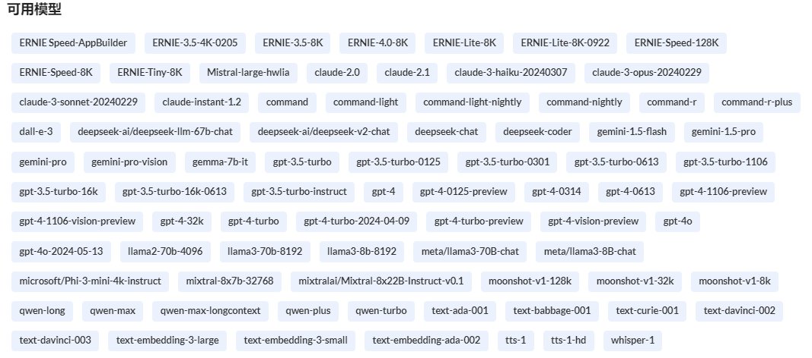
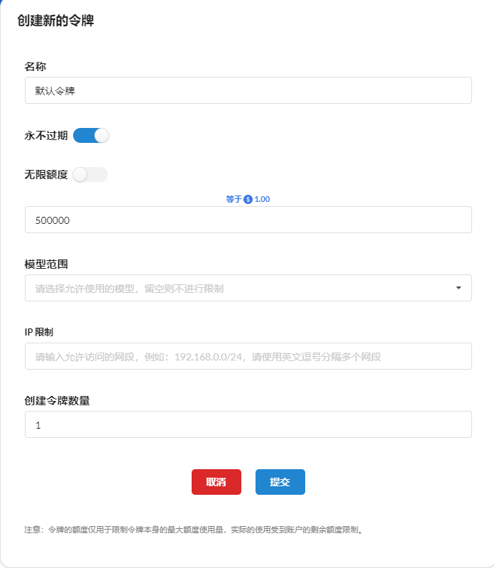
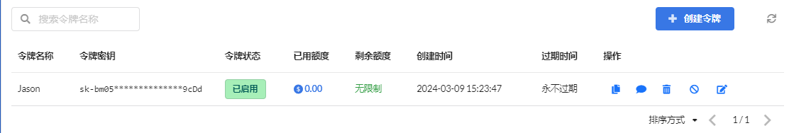
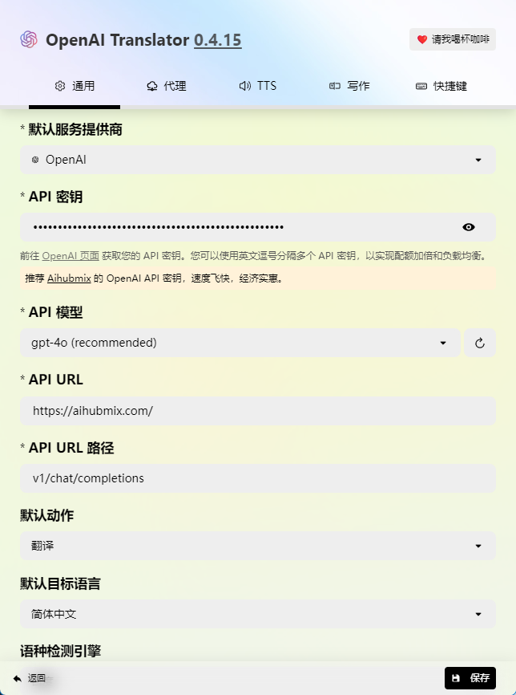
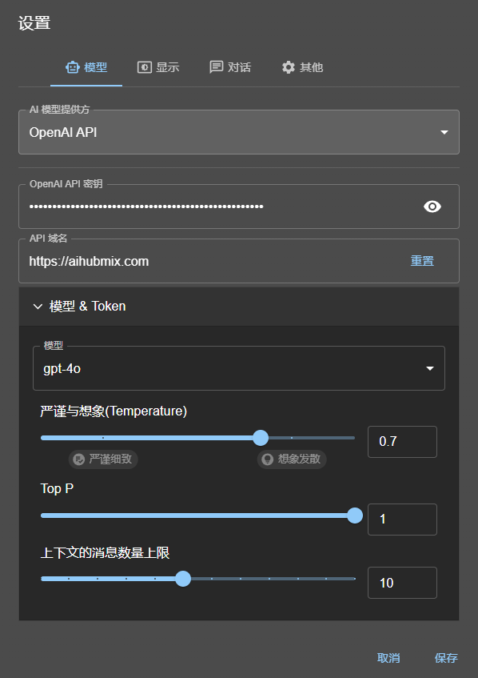
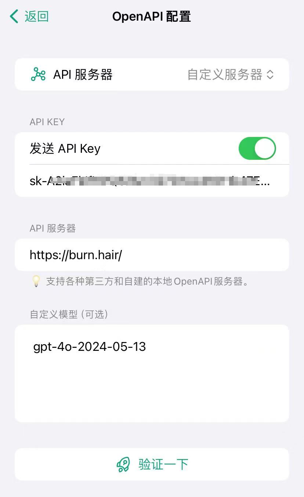

## 和网页版对比，使用 API 的优缺点

| 特性     | 网页版 ChatGPT                             | API                               |
| -------- | ------------------------------------------ | --------------------------------- |
| **优点** | - 简单易用，无需编程知识                   | - 高度灵活，可集成到各种应用      |
|          | - 用户界面友好                             | - 不需要科学上网，不用担心封号    |
|          | - 快速启动，无需设置和配置                 | - 可扩展，支持高并发和复杂任务    |
|          | - 自动更新，获取最新功能                   | - 按量计价，轻度使用非常便宜      |
| **缺点** | - 有额度限制，高强度使用时需要等待额度恢复 | - 需要一定编程知识和经验          |
|          | - 扩展性差，无法集成到其他应用             | - 需要初始设置，需 API 配置和认证 |
|          | - 服务宕机或者高负载时影响使用             | - 需要借助第三方客户端来使用      |

## 什么是 API？

API 可以理解为电力，使用 API 的客户端就是各种不同的电器，使用电力实现各种不同的功能。实际上网页版 ChatGPT 就是一个官方的客户端，背后也是在使用 API 来完成各项功能。

## API 网站的注册

使用官方的 API 同样要面对科学上网、支付渠道、封号等问题，所以在此仅推荐三个国内的 API 中转站，这些站点的使用方式基本相同，所以读者可以按喜好选择其他的中转站。

[兔子 API](https://api.tu-zi.com/)

[AiHubMix](https://aihubmix.com/)

[头顶冒火](https://burn.hair/)

以 AiHubMix 为例，可见不仅支持 ChatGPT 系列模型，市面上的主流模型都支持。

要使用 API，我们需要两个关键数据，**中转接口地址** 和 **API-Key**(也就是令牌)，中转接口地址在中转站的教程页面会注明(一般网站地址就是)，API-Key 需要自己创建。

以 AiHubMix 为例，中转接口地址就是`https://aihubmix.com`，还有一个高防御接口地址`https://api.aihubmix.com`，API-Key 在"令牌"页面点击"创建令牌"来创建，如下图

防止被盗用，可以加上过期时间和额度。

创建完成后我们就有了中转接口地址和 API-Key。

## API 客户端的配置使用

### 1. 在 OpenAI Translator 中使用 API

OpenAI Translator 是一款非常强大的开源翻译软件，[GitHub 地址](https://github.com/openai-translator/openai-translator)

默认服务提供商选择 OpenAI(大部分 API 中转站都是采用的 OpenAI 的格式)，API 密钥就是 API-Key，也就是我们刚才创建的令牌，复制进来即可，模型推荐 gpt-4o 或者自己的喜好，API URL 就是中转站地址，URL 路径是仿照 OpenAI 的路径格式，填入"v1/chat/completions"即可(不是每个客户端都需要填这一项)，至此 OpenAI Translator 的 API 配置就完成了。

### 2. 在 Chatbox 中使用 API

Chatbox 是一款强大的客户端，支持多种模型，[Chatbox 地址](https://chatboxai.app/)

同样的办法填入密钥和 API 域名，模型下面的内容不了解的建议不要更改。

### 3. 在手机软件 ChatX 中使用 API

Chatbox 是一款强大的手机 app，支持多种模型，[推特地址](https://x.com/appchatx)

要使用 API，请将设置-AI 服务器设置改为"API 模式"，然后进入"API 服务器配置"，勾选"发送 API Key"，填入中转接口地址和 API-Key。

