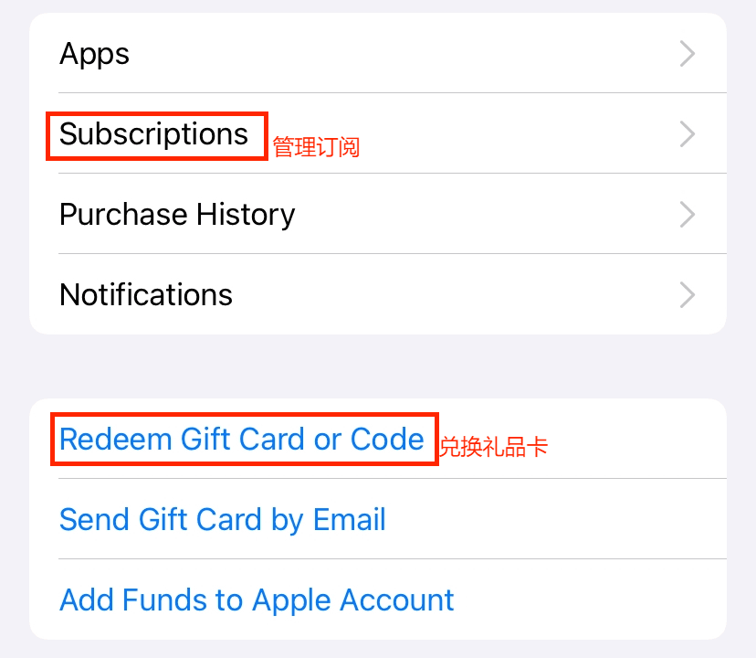

## 折扣订阅 ChatGPT PLUS 和 X Premium

由于土耳其里拉的一路走低，土耳其区已经变成了各种订阅的低价区，目前通过土耳其区 Apple Store 订阅 ChatGPT PLUS 和 X Premium 都是美元订阅的 6.5 折左右，理论上有 IOS 端的产品都可以通过这个方法订阅，读者可以自行探索。

在开始之前，如果你还没有土耳其区 Apple ID 和土耳其地址，请前往[土耳其区 Apple ID](./注册土耳其区Apple%20ID.md)页面按教程注册。

**Apple ID 和 ChatGPT 账号一定要自己注册，千万不要购买批量注册的账号，不然付费后封号的风险非常高！**

**以下操作建议全程使用土耳其节点科学上网。**

## 购买礼品卡

之前一直可以从 [oyunfor](https://www.oyunfor.com/) 购买礼品卡，但是最近支付渠道出了一点问题（中国地区接受验证短信的号码被固定为了 05\*\*的固定电话格式，导致无法正常输入手机号），可以通过 whatsapp 联系 oyunfor 客服来解决，懒得折腾可以先从闲鱼购买。

购买完成后在 **AppStore** 里面登录土耳其区账号（注意一定**不要**在系统设置里登录），点击右上角头像，选择 **Redeem Gift Card or Code**，将兑换码复制进去充值，成功后可以在账户界面看到余额。

最后打开 ChatGPT app，点击 PLUS 订阅，输入 Apple ID 密码就能成功订阅。取消订阅在 Appstore 的**订阅**里操作。

### 最后再次强调，Apple ID 和 ChatGPT 账号一定要自己注册，千万不要购买批量注册的账号，不然付费后封号的风险非常高！ChatGPT 对节点质量要求比较高，请尽量使用高质量梯子，不然容易出现降智封号等问题。风控严格的产品（说的就是你 Claude）新注册的账号请使用一段时间以后再考虑订阅 Pro 账号。

如果没有稳定的梯子可以试试我在用的这个 [红海](https://honghai.xn--cesw6hd3s99f.com/#/register?code=W6yBwyS0) ，用了快三年没有出现过降智封号的情况。

**另外 ChatGPT PLUS 在尼日利亚区有逆天的 6 美元低价，订阅方式和土耳其区基本一致，感兴趣的朋友可以自己尝试。**
