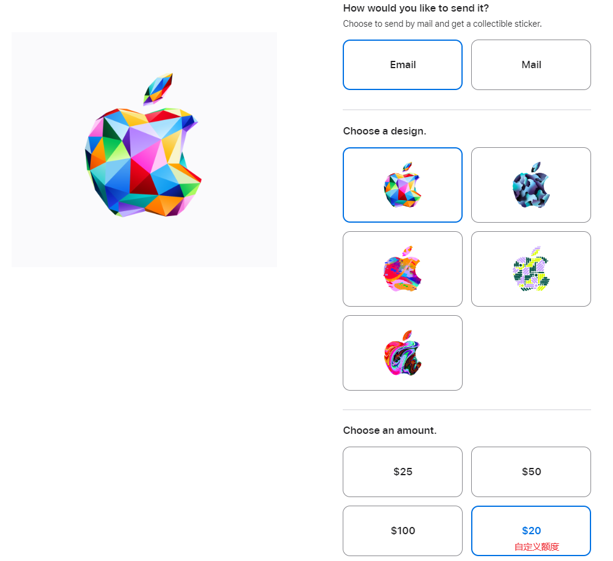
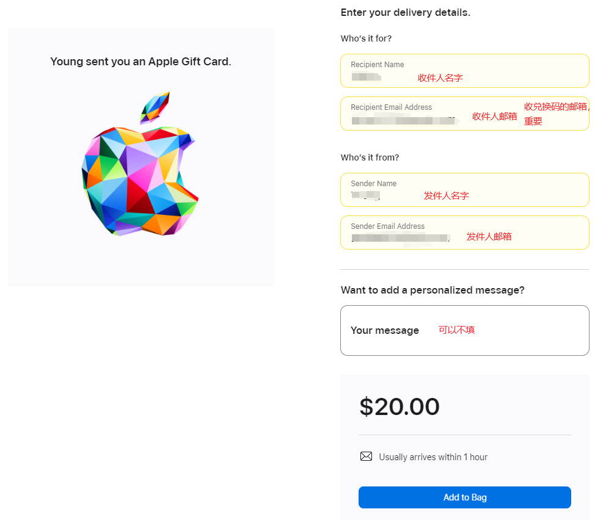
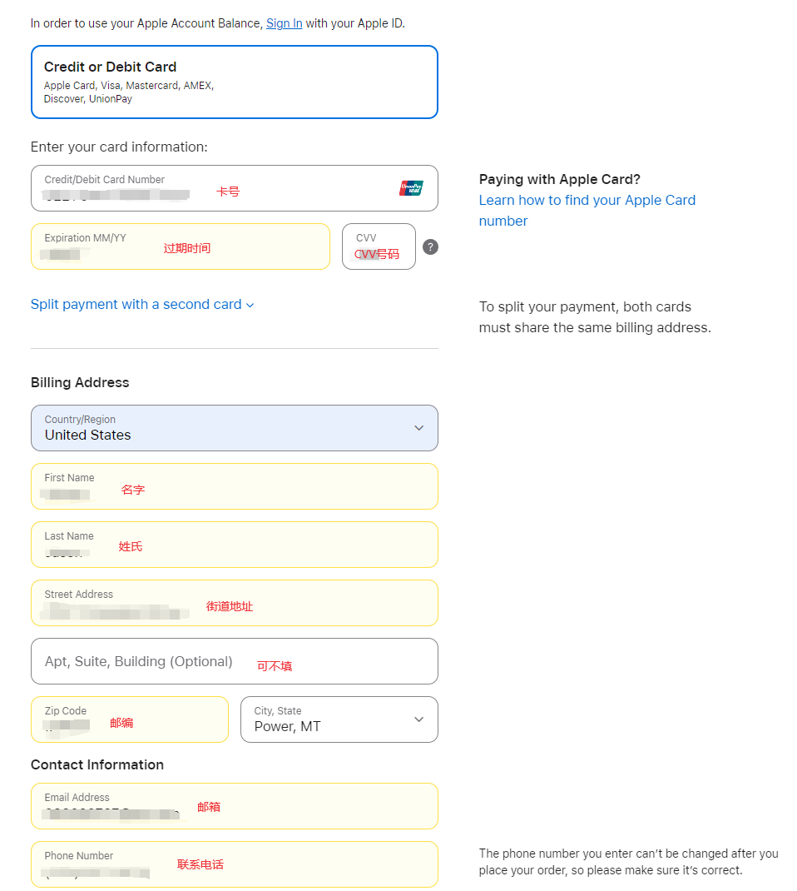
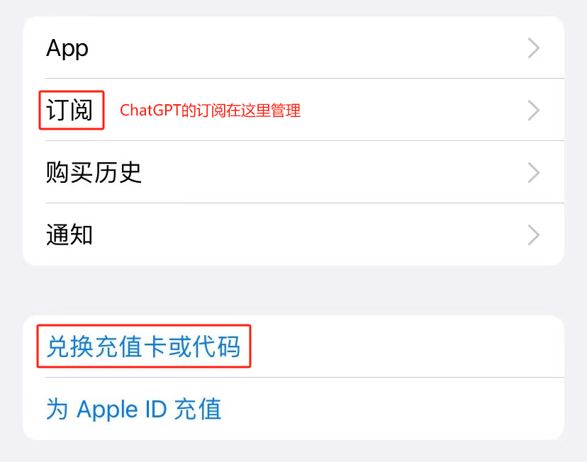

## 订阅 ChatGPT PLUS

由于 OPENAI 不支持国内的支付渠道，使用虚拟信用卡又有很高的被封号风险，订阅 ChatGPT PLUS 在国内一直是一个难题，幸好 ChatGPT IOS 端的上线解决了这个问题，本篇介绍如何在大陆地区使用银联账户通过 IOS 系统订阅 ChatGPT PLUS，Claude 等有 IOS 端的产品都可以通过这个方法订阅。

在开始之前，如果你还没有美区 Apple ID 和美国地址，请前往[美区 Apple ID](./注册美区Apple%20ID.md)，[美国地址](./获取美国联系方式及地址.md)页面按教程注册。

**Apple ID 和 ChatGPT 账号一定要自己注册，千万不要购买批量注册的账号，不然付费后封号的风险非常高！**

**以下操作建议全程使用美国节点科学上网。**

## 购买礼品卡

第一步，前往[苹果官网](https://www.apple.com/shop/buy-giftcard/giftcard)购买礼品卡。

邮寄方式选择 Email，面额选择右下角，填入 20（或者 19.99，IOS 端订阅可以节省$0.01）,然后是收件人的名字和邮箱、发件人的名字和邮箱，一定要使用自己能登录的邮箱地址，然后点击 Add to Bag。

---

检查邮箱地址无误后 Check Out，下一步因为不使用 Apple Card 支付所以直接点击 Guest 访问。

---

重头戏来了，选择 Credit or Debit Card 支付，填入银联账户的卡号、过期时间和 CVV 码。下面地址栏填入之前注册的美国地址和联系方式，再次强调一定要填免税州的地址，不然会被收税。

---

勾选同意后下订单，在下一个页面可以看到订单号，点击进入后可以查看订单进度。

---

一小时内，收件人邮箱内就能收到邮件，框里面就是兑换码，我们把它复制到手机上。

---

在**AppStore**里面登录美区账号（注意一定**不要**在系统设置里登录），点击右上角头像，选择**兑换充值卡或代码**，将兑换码复制进去充值，成功后可以在账户界面看到余额。

---

最后打开 ChatGPT app，点击 PLUS 订阅，输入 Apple ID 密码就能成功订阅。取消订阅在 Appstore 的**订阅**里操作。

### 最后再次强调，Apple ID 和 ChatGPT 账号一定要自己注册，千万不要购买批量注册的账号，不然付费后封号的风险非常高！ChatGPT 对节点质量要求比较高，请尽量使用高质量梯子。Claude 风控很严格，新注册的账号请使用一段时间以后再考虑订阅 Pro 账号。
