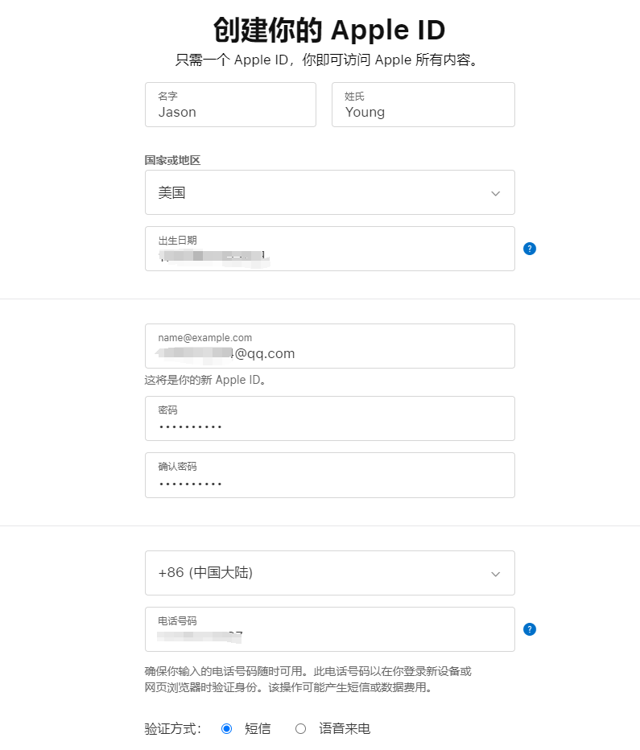
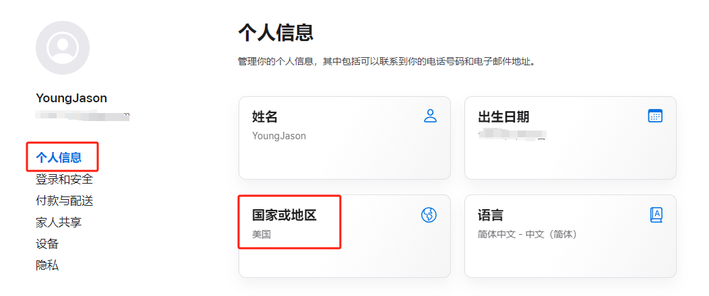
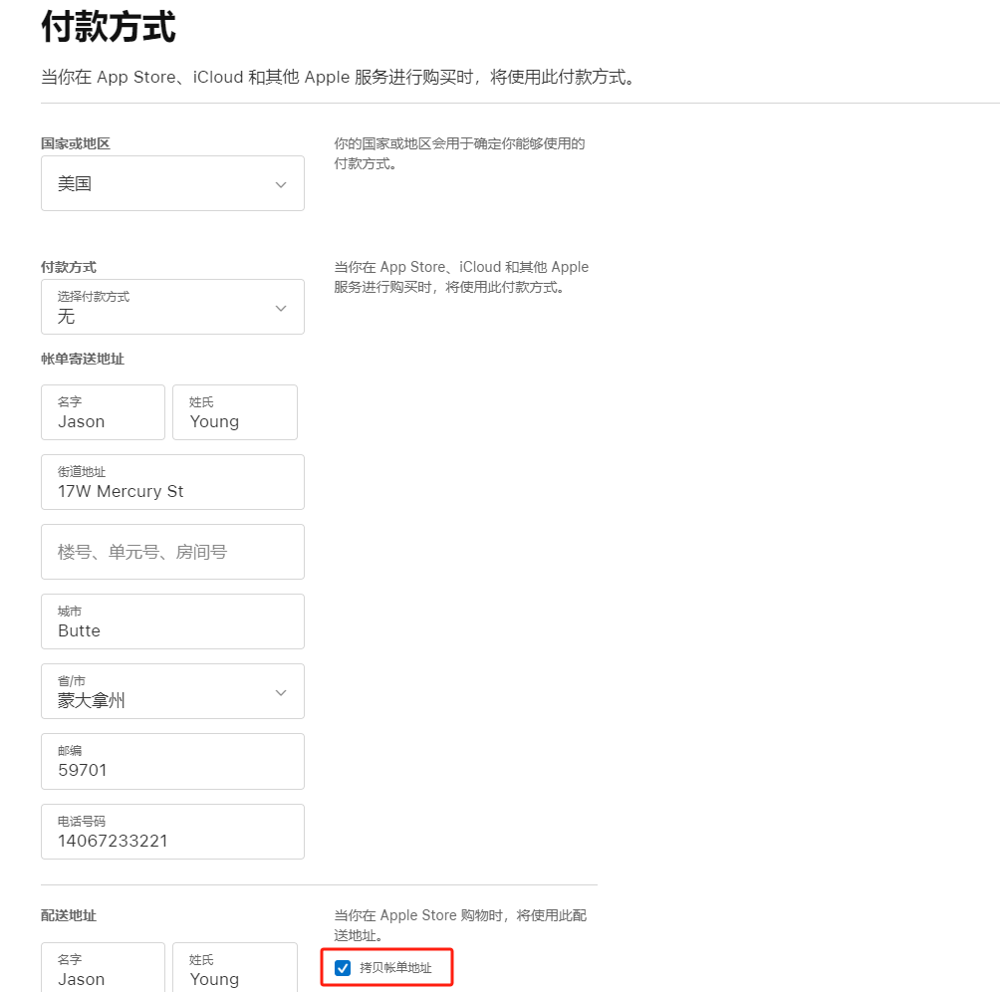

## 注册美区 Apple ID

首先我们需要按照[这个攻略](./获取美国联系方式及地址.md)生成一个美国的地址和联系方式，然后来到[苹果官网](https://appleid.apple.com/account)注册 Apple ID，建议全程使用美国节点科学上网。

## 注册 ID

地址选美国，邮箱和手机都可以使用大陆的，填完邮箱和手机的验证码后进入账户管理界面。

新注册的 ID 想在 Appstore 进行支付，需要先填写一个付款方式和账单地址，点击`个人信息`--`国家或地区`填写。

国家选美国，付款方式选`无`，因为我们只通过礼品卡充值，所以不需要绑定支付方式，下面填入我们获取的美国地址和联系方式，如果提示电话号码无效，请去[美国地址生成器](https://www.meiguodizhi.com/usa-address/montana)多刷新几个试试，因为这个号码只是账单地址所以不需要真实有效。保存信息后这个 Apple ID 就可以在 App Store 正常进行支付购买了。
